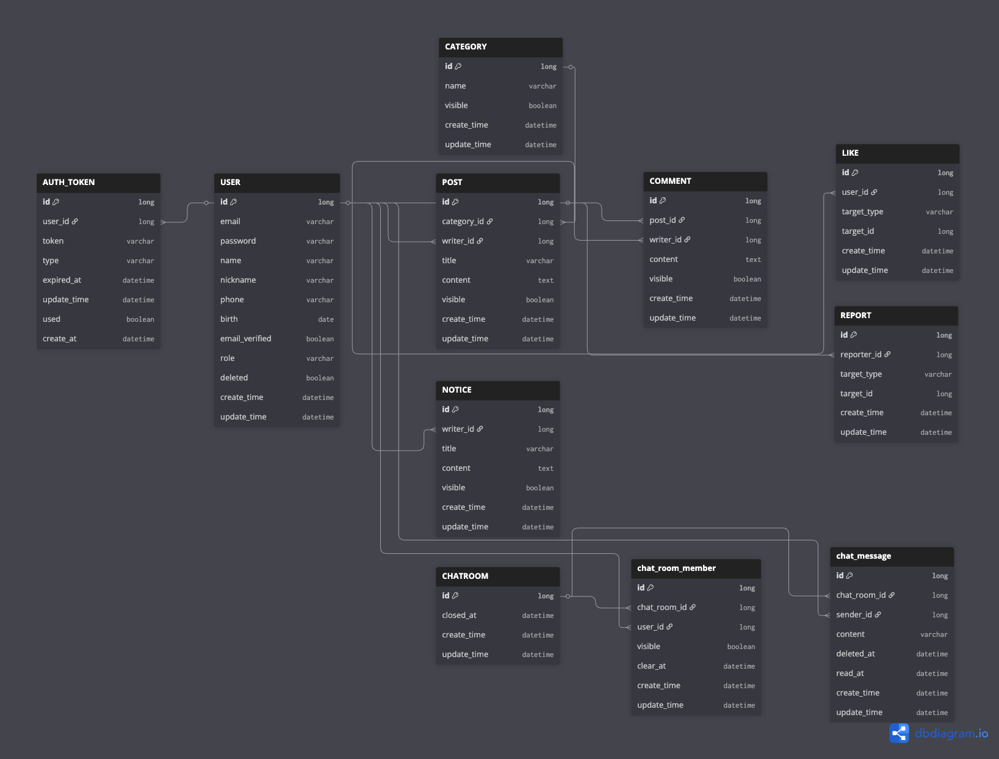

# 취미 플랫폼 프로젝트

인터페이스 기반의 모듈 결합과 WebSocket 실시간 통신을 적용한 백엔드 중심 프로젝트

---

## 📌 Project Overview

관심사가 같은 사람들끼리 취미를 공유하고 소통하는 커뮤니티입니다. 

단순한 기능 구현을 넘어 멀티 모듈 구조를 통한 계층 분리, WebSocket을 활용한 실시간성 확보, 그리고 다형성 설계를 통한 유연한 데이터 구조 구축에 집중했습니다.

## 🛠 Tech Stack
Backend Core
- Language: Java 17

- Framework: Spring Boot 3.2.x

- Build Tool: Gradle (Multi-Module Management)

- Database: MySQL 8.0 (Production), H2 (Test/Local)

- ORM: Spring Data JPA

Messaging & Real-time
- Protocol: WebSocket (STOMP)

- Library: spring-boot-starter-websocket

- Features: Pub/Sub 기반 실시간 1:1 채팅, 채팅방 세션 관리

Security & Auth
- Security: Spring Security 6.x

- Authentication: JWT (jjwt 0.12.3)

- Features: Custom JWT Filter, 인증 기반 API 접근 제어, BCrypt 패스워드 암호화

Documentation & Test
- API Doc: OpenAPI 3 (Swagger UI / springdoc-openapi 2.2.0)

- Test: JUnit5, AssertJ

- Lombok: 보일러플레이트 코드 제거 및 생산성 향상

Infrastructure & Deployment
- Dockerize
  - `Dockerfile`로 `api` 컨테이너화(포트 `8080`)
- Run (MySQL + API)
  - `docker-compose.yml`로 `mysql` + `api` 동시 실행
  - `api`에 `DB_USERNAME`, `DB_PASSWORD` env 주입 필요 (`DB_URL`은 기본값 사용 가능)
```bash
docker compose up -d --build
```
- Test: H2 그대로 사용 (`api/src/test/resources/application.properties`)
## 🏗 System Architecture (Multi-Module)

계층별 책임 분리와 모듈 간 결합도 완화를 위해 프로젝트를 독립적인 모듈로 분리하여 관리합니다.

- api-module : 전체 서비스의 Entry Point. Security 설정 및 각 도메인 서비스를 조합하여 API 제공.
- common-module : 전역 예외 처리 및 도메인 간 협력을 위한 Interface 정의 (결합도 완화).
- user-module / board-module : 회원 및 취미 게시글/댓글의 핵심 비즈니스 로직 독립 보유.
- interaction-module : 좋아요 및 신고 로직 담당. 타 모듈과의 의존성 최소화 설계.
- chat-module : websocket, stomp를 이용한 실시간 채팅 제공.

## 🚀 Key Technical Implementation
1️⃣ 멀티 모듈 환경에서 순환 참조 해결 ⭐

```
문제: 멀티 모듈 분리 이후 모듈 간 의존성이 얽히면서 순환 참조가 발생하여 애플리케이션 실행에 문제가 생겼습니다.

원인: 특정 도메인 로직이 다른 모듈의 구현을 직접 참조하면서 모듈 간 경계가 깨지고 
		 의존성이 순환 구조로 연결되었습니다.

해결: common 모듈에 인터페이스를 정의하고, 각 모듈이 이를 구현하도록 구조를 변경했습니다. 
		 또한 의존성 조합은 API 계층에서 담당하도록 역할을 분리했습니다.

결과:
- 순환 참조 제거
- 모듈 간 결합도 감소
- 유지보수성 및 확장성 향상
```

---

2️⃣ Docker 환경에서 DB 연결 문제 해결 ⭐

```
문제: docker-compose로 MySQL과 API를 실행했지만, API가 DB에 정상적으로 연결되지 않는 문제가 발생했습니다.

원인: `.env` 환경 변수와 MySQL 초기화 변수(MYSQL_*) 및 
			Spring DB 설정(DB_URL, DB_USERNAME, DB_PASSWORD) 간 매핑이 일치하지 않았고, 
			사용자 권한 설정 또한 접속 host 기준으로 맞지 않았습니다.

해결: `.env`와 docker-compose.yml의 환경 변수 구성을 통일하고, Spring이 사용하는 DB 설정이 
			MySQL 초기화 값과 정확히 매핑되도록 수정했습니다. 
			또한 DB 사용자 권한을 접속 환경에 맞게 재설정했습니다.

결과:
- Docker 환경에서 API와 DB 정상 연동
- 애플리케이션 안정적 실행
- Swagger 기반 API 테스트 가능
```

---

3️⃣ WebSocket + STOMP 기반 1:1 채팅 구현 ⭐

```
문제: WebSocket 연결은 되었지만, STOMP 기반 메시지가 특정 사용자에게 전달되지 않는 문제가 발생했습니다.

원인: 사용자 식별(Principal)과 STOMP의 user destination 경로가 일치하지 않아 메시지 전달이 실패했습니다.

해결: WebSocket 핸드셰이크 과정에서 JWT를 검증하고 Principal을 설정했으며, 
		 STOMP prefix 설정(/app, /user, /queue)을 명확히 구성했습니다. 
		 또한 convertAndSendToUser를 사용해 사용자별 메시지 전송 로직을 정리했습니다.

결과:
- 1:1 채팅 메시지 정상 전달
- 실시간 통신 안정성 확보
- 채팅 기능 확장 가능 구조 구현
```

## 📊 Data Modeling (ERD)
  프로젝트의 전체 데이터 구조입니다. 설계의 핵심은 다형성을 활용한 상호작용 관리와 채팅 데이터의 정규화입니다.



- 다형성(Polymorphism): LIKE, REPORT 테이블에서 target_type을 사용하여 게시글/댓글 등 다양한 대상을 유연하게 처리.

- 관계 설계: chat_room_member 중간 테이블을 활용한 유저-채팅방 간의 관계 최적화.

## 🔍 Troubleshooting (백엔드 고민 지점)
- 순환 참조 해결: 모듈 분리 후 발생한 의존성 사이클을 API 계층에서의 로직 조합과 인터페이스 추출을 통해 해결.

- 멀티 모듈 빈(Bean) 스캔: 서로 다른 모듈에 흩어진 Component들을 메인 어플리케이션에서 인식하도록 스캔 범위 최적화.

## 📝 Detailed Progress (기존 개발 기록)

<details>
<summary>기능 구현 상세 리스트 펼치기</summary>

- 설정
- [x] Swagger
- [x] Security
- [x] MailSender
- [x] PasswordEncoder
- [x] Jwt Filter


- 회원 
- [x] 회원가입
- [x] 이메일 인증
- [x] 로그인
- [x] 회원 정보 수정(회원)
- [x] 비밀번호 재설정
- [x] 회원 관리 (관리자)
- [x] 회원 탈퇴, 복구


- 게시판 / 공지사항
- [x] 카테고리 등록(회원/ 관리자)
- [x] 카테고리 관리(조회, 삭제) (관리자)
- [x] 게시글 작성 (회원)
- [x] 게시글 조회 (회원)
- [x] 게시글 상세 조회(회원 / 관리자)
- [x] 게시글 조회(전체, 비공개만, 공개만, 카테고리별, 이메일별) (관리자)
- [x] 게시글 수정 (회원)
- [x] 게시글 삭제 (회원)
- [x] 게시글 숨김 (관리자 -> 신고 20개 이상일 경우)
- [x] 댓글 작성 (회원)
- [x] 댓글 조회 (회원/ 관리자)
- [x] 댓글 수정 (회원)
- [x] 댓글 삭제 (회원)
- [x] 댓글 숨김 (관리자 -> 신고 20개 이상일 경우)
- [x] 공지사항 작성 (관리자)
- [x] 공지사항 조회 (관리자)
- [x] 공지사항 수정 (관리자)
- [x] 공지사항 삭제 (관리자)
- [x] 공지사항 공개여부 (관리자)


- 상호작용
- [x] 게시글 좋아요 / 취소 (회원)
- [x] 댓글 좋아요 / 취소 (회원)
- [x] 좋아요 개수 구하기
- [x] 좋아요 관련 조회 (좋아요 한 게시글, 댓글별 조회)(회원)
- [x] 게시판 / 댓글 신고 하기 (회원)
- [x] 신고 조회 (전체, 아이디별, 게시글별, 댓글별) (관리자)
- [x] 신고 취소 (회원)
- [x] 신고 수 


- 채팅
- [x] 채팅방 만들기
- [x] 메시지 보내기
- [x] 보낸 메시지 삭제하기
- [x] 읽음 여부

</details>

---

## 🖥️ 시연영상(Gif)
- Swagger Api
  

- 로그인, JWT

- 게시글 업로드, 불러오기


- 실시간 채팅

- Docker
  
